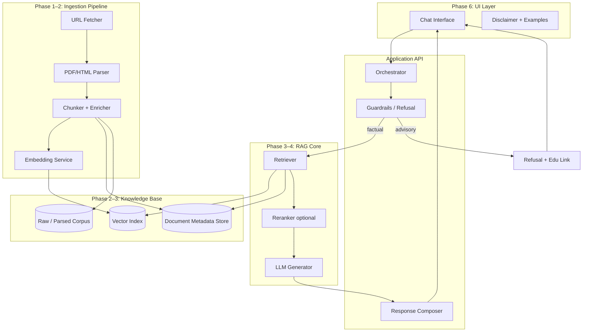
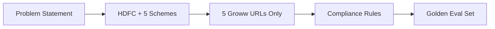
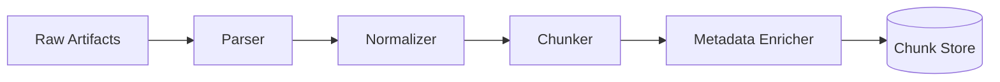
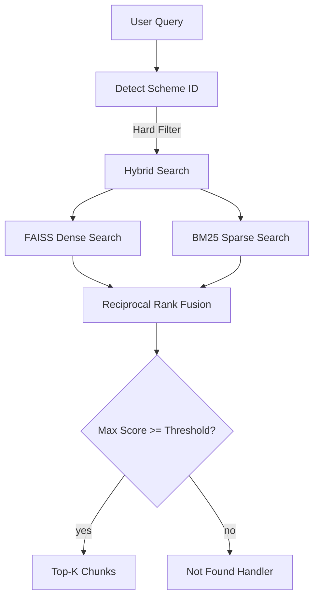
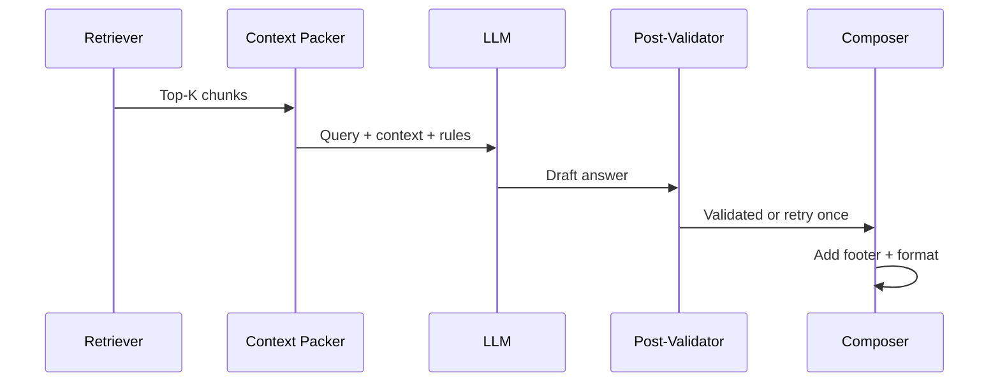
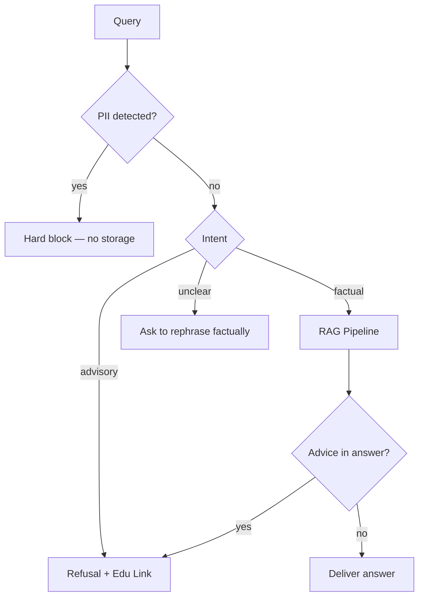
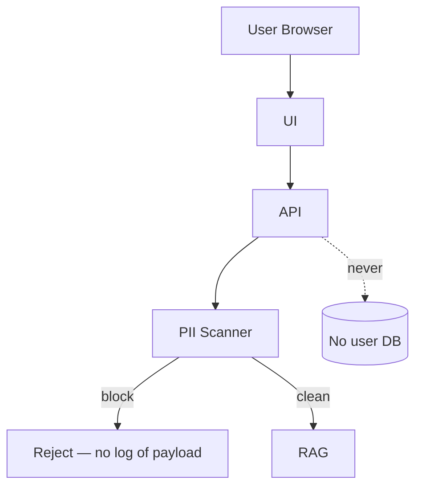

# Architecture: Mutual Fund FAQ Assistant (Facts-Only RAG)

This document defines a phased architecture for a lightweight, compliance-first Retrieval-Augmented Generation (RAG) assistant that answers factual mutual fund queries for HDFC schemes. It is derived from [problemStatement.md](./problemStatement.md).

### Closed corpus policy (project constraint)

**This project uses exactly five URLs—no more, no less.** The entire knowledge base is built exclusively from the Groww scheme pages listed in Phase 0. Ingestion, retrieval, citations, and refusal links must not fetch, index, or cite any other URL (including AMC factsheets, AMFI, SEBI, or other Groww pages).

| Rule | Detail |
|------|--------|
| Corpus size | Fixed at **5 URLs** |
| Allowed domain | `groww.in` only, and only the five registered paths |
| No expansion | Do not add URLs in Phase 1 or later phases |
| No link following | Do not crawl outbound links from scheme pages |
| Citations | Every response cites **one** URL from the closed set |

---

## 1. Architecture Principles

| Principle | Implication |
|-----------|-------------|
| **Facts-only** | Retrieve and paraphrase verifiable facts; never rank, recommend, or compare performance. |
| **Source-backed** | Every answer cites exactly one URL from the **closed five-URL corpus**. |
| **Closed corpus** | All facts come from indexed content on those five pages only; if not on-page, say so—do not go elsewhere. |
| **Constrained output** | Max 3 sentences + one citation + mandatory footer with last-updated date. |
| **Fail-safe refusals** | Advisory or subjective queries are blocked before or instead of generation. |
| **Privacy by design** | No PII collection (PAN, Aadhaar, account numbers, OTPs, email, phone). |
| **Transparency over fluency** | Prefer “not found in corpus” over hallucinated facts. |

---

## 2. High-Level System View



**Request path (happy path):** User query → guardrails classify as factual → retrieve top-k chunks → optional rerank → LLM generates bounded answer with citation → composer adds footer → UI renders.

**Refusal path:** Advisory/subjective query → guardrails short-circuit → templated refusal + one link from the closed five-URL set (no retrieval/generation).

---

## 3. Technology Stack (Recommended, Swappable)

| Layer | Suggested choice | Role |
|-------|------------------|------|
| Runtime | Python 3.11+ | Ingestion, API, RAG |
| API | FastAPI | `/chat`, `/health`, optional `/ingest` (admin) |
| Vector DB | Chroma / FAISS / Qdrant (local) | Semantic retrieval |
| Embeddings | `text-embedding-3-small` or open-source (e.g. `bge-small-en`) | Chunk vectors |
| LLM | Groq API (e.g., Llama-3 70B / Mixtral 8x7B) | Grounded generation |
| Parsing | `pypdf`, `beautifulsoup4`, `trafilatura` | PDF + HTML |
| UI | Streamlit or minimal React + Vite | Chat + disclaimer |
| Config | `.env` + `config.yaml` | AMC, schemes, URLs, prompts |
| Orchestration (optional) | LangChain / LlamaIndex / custom thin layer | Pipeline glue |

Keep the stack **minimal** for the assignment scope; avoid microservices until scale demands it.

---

## 4. Data Model (Cross-Phase)

### 4.1 Document metadata (per chunk)

```yaml
chunk_id: string          # stable UUID
source_url: string        # must be one of the five closed corpus URLs
document_type: enum       # scheme_page (Groww)
amc: string
scheme_name: string | null
scheme_category: string | null  # large-cap, flexi-cap, elss, etc.
section_title: string | null
content_hash: string
fetched_at: iso8601
source_last_updated: date | null  # from page/PDF if available
text: string
embedding_id: string
```

### 4.2 Corpus registry (immutable, 5 rows)

`data/url_registry.csv` contains **exactly five rows**—one per scheme URL below. No additional rows are permitted.

| Field | Description |
|-------|-------------|
| `url` | One of the five closed Groww scheme URLs |
| `scheme` | Mapped HDFC scheme name |
| `priority` | Always primary (each page is its own citation source) |
| `refresh_cadence` | e.g. weekly re-fetch of the same five URLs only |

### 4.3 Query audit log (no PII)

Store only: `timestamp`, `query_hash`, `intent_label`, `refused: bool`, `citation_url`, `latency_ms` — never raw PAN/account data.

---

## 5. Phase-Wise Architecture

### Phase 0: Foundation & Compliance Design

**Goal:** Lock scope, compliance rules, and success metrics before building.

#### Selected AMC and schemes (project scope)

| AMC | HDFC Mutual Fund |
|-----|------------------|
| **Reference product context** | Groww mutual fund scheme pages |

| # | Scheme | Category | Corpus URL (exclusive source) |
|---|--------|----------|-------------------------------|
| 1 | HDFC Mid Cap Fund — Direct — Growth | Mid-cap | https://groww.in/mutual-funds/hdfc-mid-cap-fund-direct-growth |
| 2 | HDFC Equity Fund — Direct — Growth | Diversified equity | https://groww.in/mutual-funds/hdfc-equity-fund-direct-growth |
| 3 | HDFC Focused Fund — Direct — Growth | Focused / concentrated equity | https://groww.in/mutual-funds/hdfc-focused-fund-direct-growth |
| 4 | HDFC ELSS Tax Saver Fund — Direct Plan — Growth | ELSS (tax saver) | https://groww.in/mutual-funds/hdfc-elss-tax-saver-fund-direct-plan-growth |
| 5 | HDFC Large Cap Fund — Direct — Growth | Large-cap | https://groww.in/mutual-funds/hdfc-large-cap-fund-direct-growth |

These five URLs are the **complete and exclusive corpus** for this project—ingestion, indexing, retrieval, and citations must not use any other source. They provide category diversity (large-cap, mid-cap, focused, diversified equity, ELSS) and are defined in `config/amc.yaml`, `data/url_registry.csv`, and README.

**Closed URL registry (final):**

```yaml
amc: HDFC Mutual Fund
schemes:
  - name: HDFC Mid Cap Fund Direct Growth
    category: mid-cap
    url: https://groww.in/mutual-funds/hdfc-mid-cap-fund-direct-growth
  - name: HDFC Equity Fund Direct Growth
    category: diversified-equity
    url: https://groww.in/mutual-funds/hdfc-equity-fund-direct-growth
  - name: HDFC Focused Fund Direct Growth
    category: focused-equity
    url: https://groww.in/mutual-funds/hdfc-focused-fund-direct-growth
  - name: HDFC ELSS Tax Saver Fund Direct Plan Growth
    category: elss
    url: https://groww.in/mutual-funds/hdfc-elss-tax-saver-fund-direct-plan-growth
  - name: HDFC Large Cap Fund Direct Growth
    category: large-cap
    url: https://groww.in/mutual-funds/hdfc-large-cap-fund-direct-growth
```

| Workstream | Activities | Outputs |
|------------|------------|---------|
| AMC & schemes | HDFC AMC; 5 schemes (table above) | `config/amc.yaml`, scheme list in README |
| URL inventory | **Exactly** the 5 Groww URLs above—no other URLs | `data/url_registry.csv` (5 rows, frozen) |
| Policy spec | Facts-only rules, refusal copy, footer format, 3-sentence cap | `docs/complianceRules.md` |
| Evaluation rubric | Golden Q&A set + refusal cases | `eval/golden_queries.jsonl` |

**Architecture decisions:**

- Single-tenant corpus (HDFC only, five pages only) simplifies citation consistency.
- Each scheme’s Groww page is the **only** permissible citation for facts about that scheme.
- If a fact is not present on the relevant page (or retrieval score is below threshold), respond with a not-found message and cite the best-matching scheme URL from the closed set—never invent facts or add URLs.



**Exit criteria:** Frozen five-URL list in `config/amc.yaml` and `data/url_registry.csv`, scheme map complete, eval set scoped to facts available on these pages.

---

### Phase 1: Corpus Definition & Acquisition

**Goal:** Fetch and version content from the **five closed corpus URLs only**.

#### Sub-phase 1.1 — Fetcher
**Purpose:** pull the 5 Groww HTML pages and persist raw snapshots.
**Input:** `config/sources.yaml` (the 5 URLs from Phase 0).
**Output:** `data/raw/<scheme_id>/<timestamp>.html` + a sibling `meta.json` per fetch (`{url, fetched_at, http_status, etag, content_hash_raw, fetcher_kind}`).
**Module:** `src/mf_faq/ingestion/fetcher.py → Fetcher.fetch_all() -> list[FetchResult]`.
**Tech:** `httpx` for plain HTTP; if extracted text length / required-keyword presence is below threshold, fall back to a headless renderer (`playwright`).
**Behavior:**
- Respect `robots.txt` before each scheduled run; abort whole run if disallowed.
- Send `If-None-Match` (ETag) on subsequent runs; on 304, skip and reuse the previous snapshot.
- On 4xx/429: stop, alert, retry next scheduled run — never bypass anti-bot.
- On 301/302 of a whitelisted URL: do not auto-follow; raise a governance alert.
**Edge cases addressed:** EC-1.1, EC-1.2, EC-1.3, EC-1.10.
**Exit criteria:** all 5 URLs fetched, each `data/raw/.../*.html` ≥ a minimum byte size, `meta.json` present, fetcher run reports `health=ok` for all 5.

#### Sub-phase 1.2 — Extractor
**Purpose:** HTML → structured text with section anchors (Overview, Scheme Details, Exit Load, Expense Ratio, Min SIP, Riskometer, Benchmark, FAQs).
**Input:** raw HTML files from 1.1.
**Output:** `data/processed/<scheme_id>/extracted.json`:
```json
{
  "scheme_id": "hdfc_equity",
  "source_url": "https://groww.in/...",
  "fetched_at": "2026-05-03T10:00:00Z",
  "sections": [
    {"name": "Expense Ratio", "text": "..."},
    {"name": "Exit Load",     "text": "..."},
    {"name": "Scheme Details","text": "..."}
  ],
  "must_have_anchors": {"Expense Ratio": true, "Exit Load": true},
  "extraction_health": "ok"
}
```
**Module:** `src/mf_faq/ingestion/extractor.py → Extractor.extract(html, scheme_id) -> ExtractedDoc`.
**Tech:** `trafilatura` for main-body text + targeted CSS/XPath selectors for each must-have anchor + BeautifulSoup for table cells (expense ratio, exit load).
**Behavior:**
- Maintain a per-page must-have anchors list; a missing anchor flips `extraction_health` to `degraded` and is logged.
- For image-only facts (riskometer SVG): read alt / aria-label / sibling caption; if all absent, mark not-extracted (no OCR).
- Run desktop viewport when JS rendering is needed; auto-expand `[aria-expanded="false"]` accordions.
**Edge cases addressed:** EC-1.4, EC-1.5, EC-1.7, EC-1.10.
**Exit criteria:** for all 5 schemes, extracted JSON exists; ≥ 4 of the must-have anchors present per page; `extraction_health=ok` on the golden snapshot.

#### Sub-phase 1.3 — Cleaner & Normalizer
**Purpose:** strip boilerplate, normalize encoding so retrieval tokens match user queries.
**Input:** extracted JSON from 1.2.
**Output:** `data/processed/<scheme_id>/cleaned.json` — same shape as extracted, but each section's text is cleaned.
**Module:** `src/mf_faq/ingestion/cleaner.py → Cleaner.clean(doc) -> ExtractedDoc`.
**Behavior:**
- Drop known boilerplate ("Mutual fund investments are subject to market risks…", "You may also like", footer links).
- Unicode NFKC normalization; collapse whitespace; map Rs. / INR → ₹; normalize %, –, —, smart quotes.
- Strip volatile fields from a separate stable view of the doc (NAV, "as on ", today's AUM) to feed the stable `content_hash` (see 1.7).
- Section drop / trim policy (gatekeeper for what flows into 1.4+):
  - **Drop entirely:** the FAQ section. The extractor still parses the FAQPage JSON-LD as a must-have-anchor health signal, but the Q&A content (mostly Groww UX guidance, "How do I invest…?") is not part of the facts-only corpus.
  - **Trim aggressively:** Fund Manager keeps just the manager's name and tenure (`<Initials> <Name> <Joined> - Present`); the bio (Education / Experience) is dropped. Fund House keeps the AMC name, rank, total AUM, and incorporation date; phone / email / website / address are dropped.
**Edge cases addressed:** EC-1.6, EC-1.8, EC-1.12.
**Exit criteria:** cleaned text contains zero entries from the boilerplate strip-list; `cleaned.json` contains no FAQ section; the Fund Manager and Fund House sections do not contain bios or contact details; Rs.500 / Rs. 500 / ₹500 all collapse to ₹500.

#### Sub-phase 1.4 — Chunker
**Purpose:** section-aware splitting into retrieval units, with full provenance metadata.
**Input:** cleaned JSON from 1.3.
**Corpus reality (recalibrated after 1.3):** the 5 trimmed Groww product pages produce ~8 sections per scheme, with most of them being extremely short (Expense Ratio, Exit Load, Benchmark, Minimum Investments, Fund Manager, Fund House, About) averaging < 25 tokens. The FAQ section is completely dropped. The "Main Body" section is the only large section (~400–500 tokens) and contains extensive markdown tables (holdings, performance, category comparisons) alongside trailing paragraphs. The behavior below reflects these realities.
**Output:** `data/processed/<scheme_id>/chunks.jsonl` — one JSON per line:
```json
{
  "chunk_id": "uuid",
  "scheme_id": "hdfc_equity",
  "scheme_name": "HDFC Equity Fund - Direct Growth",
  "doc_type": "Product_Page",
  "source_url": "https://groww.in/mutual-funds/hdfc-equity-fund-direct-growth",
  "section": "Exit Load and Tax",
  "section_source": "html_section | meta_description",
  "last_updated": "2026-04-15",
  "content_hash": "sha256:...",
  "stable_content_hash": "sha256:...",
  "text": "..."
}
```
`section_source` is propagated from the cleaner's `Section.source` so retrieval can reason about provenance. `stable_content_hash` is the document-level hash from 1.3 (same value on every chunk of a given snapshot) — sub-phase 1.7 uses it to skip re-indexing when only NAV/AUM ticked.
**Module:** `src/mf_faq/ingestion/chunker/service.py → Chunker.chunk(doc: CleanedDoc) -> Iterable[Chunk]`.
**Behavior:**
- Section never spans chunks. Each chunk's section is exactly one cleaned-doc section name — never a comma-joined list.
- One section → one chunk by default. All sections except Main Body fall well under the soft cap (~250 tokens) and are emitted whole; this is good for fact-shaped queries because each chunk is a self-contained unit.
- Soft cap = 250 tokens, hard cap = 400 tokens, overlap = 30 tokens — only triggers for long sections (Main Body). Splits happen on sentence boundaries or table row boundaries; never mid-sentence and never mid-numeric-fact (e.g., "₹14,615.19 Cr" must stay together). Because the Cleaner collapses all newlines into spaces, the massive Main Body tables must be split using markdown table pipe heuristics (e.g., splitting on ` | | ` or `| |`) rather than newlines, to keep tabular context intact.
- No `scheme_name` prepend in chunk text — the embedder (1.5) prepends it transiently before vectorization to avoid near-duplicate boilerplate clustering across schemes (EC-1.8). Storing it in text would corrupt downstream display and BM25 tokenization.
- Atomic table rows — when sections like Fund Details contain effectively tabular text ("Min. for SIP ₹500 Fund size (AUM) ₹14,615.19 Cr Expense ratio 1.11%"), the splitter treats them as one unit even if a future Groww layout grows them.
- Drop empty / tiny chunks — if a section's text is < 5 tokens after cleaning (degenerate case), skip it.
**Edge cases addressed:** EC-1.8 (near-duplicate boilerplate), EC-1.9 (cross-section bleed), EC-2.5 (wrong-section retrieval — section metadata feeds the Phase 2 reranker).
**Expected output volume:** ~8-12 chunks per scheme (largely driven by the compact metadata sections and Main Body tables) → ~40-60 chunks total across the 5 schemes.
**Exit criteria:**
- Each chunk's section is a single value drawn from the cleaned doc's section set.
- Every chunk's `source_url` ∈ the Phase 0 whitelist (string-equal match).
- Total chunk count is in the band 5 ≤ n ≤ 20 per scheme (current expectation: ~12).
- For each scheme, the union of all chunks' text covers every section name present in `cleaned.json` (no fact silently dropped).
- Numeric facts (₹X Cr, X.XX%, X year(s)) are never split across chunks.


#### Sub-phase 1.5 — Embedder
**Purpose:** generate dense vectors per chunk.
**Input:** chunks from 1.4.
**Output:** `data/index/embeddings.parquet` (or `.npy` + `chunks.jsonl` sidecar) with rows `{chunk_id, embedding[float32]}` and a sidecar `embedder.json`: `{"model": "bge-small-en", "version": "1.5", "dim": 384}`.
**Module:** `src/mf_faq/ingestion/embedder.py → Embedder.embed(chunks) -> EmbeddingBatch`.
**Tech:** `bge-small-en` via `sentence-transformers`, OR `text-embedding-3-small` via the OpenAI API (configurable).
**Behavior:**
- Embed `f"{scheme_name}\n\n{text}"` so near-duplicate boilerplate across schemes still vectors-apart (EC-1.8).
- Persist the embedder model + version next to vectors; retriever (Phase 2) refuses to load mismatched versions.
**Edge cases addressed:** EC-1.8, EC-1.11.
**Exit criteria:** every chunk has exactly one embedding of expected dimension; `embedder.json` is present; reload round-trip preserves vectors bit-for-bit.

#### Sub-phase 1.6 — Indexer
**Purpose:** build the dense + BM25 indexes that Phase 2 queries against.
**Input:** chunks (1.4) + embeddings (1.5).
**Output:** `data/index/`:
- `vector.faiss` (or `chroma/`) — dense index keyed by `chunk_id`.
- `bm25.pkl` — sparse index over chunk text.
- `chunks.jsonl` — canonical chunk store (with metadata).
- `manifest.json` — `{built_at, embedder, n_chunks, per_scheme_counts, source_hashes}`.
**Module:** `src/mf_faq/ingestion/indexer.py → Indexer.build(), Indexer.load() -> IndexHandle`.
**Tech:** FAISS or Chroma for dense; rank_bm25 / Whoosh for sparse.
**Behavior:**
- Atomic swap: build into `data/index/.staging/`, then rename. Phase 2 readers see only fully-built indexes.
- Manifest doubles as the corpus passport — Phase 5 reads it for freshness reporting.
**Edge cases addressed:** EC-1.11.
**Exit criteria:** Phase 2 can open the index and run a sample query end-to-end; manifest's `n_chunks` matches the chunk store; per-scheme counts are non-zero for all 5.

#### Sub-phase 1.7 — Refresh & Health
**Purpose:** orchestrate 1.1 → 1.6 as a re-runnable pipeline with drift detection and health reporting. This is the only sub-phase that uses all the others.
**Input:** none directly — runs on a schedule.
**Output:** `data/index/refresh_log.jsonl` — one line per run with per-stage timings, content-hash diffs, anchor health, and outcome ∈ `{ok, partial, frozen}`.
**Module:** `src/mf_faq/ingestion/pipeline/service.py → Pipeline.refresh(force=False, dry_run=False, skip_fetch=False)`; CLI: `python -m mf_faq.ingestion.refresh` (`src/mf_faq/ingestion/refresh.py`).
**Scheduler:** GitHub Actions
- We exclusively use a GitHub Actions workflow under `.github/workflows/` with `on: schedule:` using UTC cron to automatically pull the latest snapshots from the 5 whitelisted URLs.
- Also expose `workflow_dispatch` so maintainers can refresh on demand without waiting for the next cron tick.
- Typical job steps: checkout → install Python + deps (`pip install -e .`) → run fetch → extract/clean → chunk → embed → index → upload `data/index/` and process outputs as workflow artifacts or push to object storage.
- Respect the same governance rules as local runs: `robots.txt` gate (1.1), no auto-follow on redirects, freeze/drift behavior below.
**Behavior:**
- For each URL, compute `stable_content_hash` (volatile fields excluded — see 1.3); only re-chunk + re-embed pages whose stable hash changed.
- On drift across ≥ 2 URLs in the same window → freeze the index (don't overwrite), raise a single aggregated alert.
- Soft-404 detection (HTTP 200 but missing must-have anchors) → fail that URL, keep the rest.
- "Last updated from sources" date in chunk metadata is bumped only when stable content actually changed.
**Edge cases addressed:** EC-1.6, EC-1.10, EC-5.7, EC-5.8.
**Exit criteria:** dry-run on the bundled snapshot fixtures produces a deterministic `refresh_log.jsonl`; a synthetic drift across 3 URLs triggers the freeze path with one alert.

---

### Phase 2: Document Processing & Chunking

**Goal:** Turn raw documents into searchable, metadata-rich chunks.

#### Components

1. **HTML parser** — Groww scheme page main content extraction (strip nav/ads/footers).
2. **Normalizer** — Unicode cleanup, table flattening, header detection.
3. **Chunker** — Semantic or structured chunks (512–1024 tokens, 10–15% overlap).
4. **Metadata enricher** — Attach `scheme_name`, `document_type`, `section_title`; extract “last updated” from page when present.
5. **Chunk store** — JSONL or SQLite: `data/processed/chunks.jsonl`.

#### Chunking strategy

| Page section (Groww) | Strategy |
|----------------------|----------|
| Fund overview / objective | Section-aware chunks with `scheme_name` |
| Key facts (expense ratio, exit load, min SIP, lock-in, riskometer, benchmark) | One chunk per labeled field where possible |
| Holdings / performance UI | Index visible labels only; do not compute or compare returns |
| FAQs on page (if present) | Q/A pair as single chunk |



**Exit criteria:** Chunks cover all target fact types (expense ratio, exit load, min SIP, ELSS lock-in, riskometer, benchmark, download process); spot-check metadata accuracy.

---

### Phase 3: Indexing, Retrieval & Generation

**Goal:** Enable accurate semantic and lexical retrieval using a Metadata-Filtered Hybrid Search strategy.

#### Components & Strategy

1. **Mandatory Pre-Filtering (Metadata Routing)** — Before any search runs, a lightweight regex or intent classifier detects if a specific scheme is mentioned. We apply a **hard metadata filter** on `scheme_id` to prevent cross-fund hallucination, which is critical due to identical boilerplate across the 5 Groww pages.
2. **Hybrid Search (Dense + Sparse Fusion)** — 
   - **Dense (FAISS / `bge-small-en`)**: Captures semantic intent ("management fees" → "Expense Ratio").
   - **Sparse (BM25)**: Captures exact numerical or keyword matches (e.g., "1.11%", "NIFTY 500").
   - **Fusion**: Retrieve top candidates from both and fuse them using Reciprocal Rank Fusion (RRF).
   - **Top-K Limitation**: Given the highly atomic tabular nature of our data, strictly limit the final retrieved context to the **Top 3 to 5 chunks**. This prevents context window dilution and hallucination.
3. **Thresholding, PII & Fallback** — If the query contains Personal Identifiable Information (PII) or if the fused top chunk falls below a minimum similarity confidence, the retriever intercepts the pipeline and halts generation. It returns a strict "Not Found" or "Refused" message **with NO URL ATTACHED**. We absolutely do not append educational links to PII or unknown queries.

#### Retrieval policy

| Query signal | Behavior |
|--------------|----------|
| Scheme named | Hard filter `scheme_id` to strictly limit search to that fund's chunks |
| Process / how-to | Retrieve from page content only; if absent → not found (**NO URL attached**) |
| Ambiguous scheme | Retrieve across five pages; if scores below threshold → not found (**NO URL attached**) |
| PII / Personal Info | Immediate hard block → refused (**NO URL attached**) |
| Performance/returns | Hybrid search for exact numbers; do not compute or summarize |



**Exit criteria:** Golden queries return relevant chunks in top-3 for ≥90% of eval set (tune before generation phase).

---

### Phase 4: (Merged into Phase 3)

**Goal:** Produce compliant, short, cited answers grounded in retrieved context.

#### Components

1. **Context packer** — Deduplicate chunks; cap token budget; include metadata for citation selection.
2. **Prompt template** — System: facts-only, max 3 sentences, one URL, no advice; User: query + context.
3. **LLM generator** — Temperature low (0–0.3); structured output optional (JSON: `answer`, `citation_url`).
4. **Citation selector** — If model cites any URL outside the closed set, **override** with highest-confidence chunk `source_url` (must be one of the five).
5. **Response composer** — Append footer: `Last updated from sources: <date>` using max(`source_last_updated`) from context or `fetched_at` fallback.
6. **Post-validator** — Sentence count ≤ 3; exactly one URL; banned phrases (recommend, better fund, should invest).

#### Generation flow



#### Performance-related queries (special case)

- **Do not** summarize returns or compare funds.
- Response template: one sentence directing user to the scheme’s Groww page for performance data + that page’s URL from the closed set + footer.

**Exit criteria:** Eval set answers pass automated checks (length, citation ∈ closed five-URL set, footer present) and human spot-check for accuracy.

---

### Phase 5: Guardrails & Refusal Handling

**Goal:** Block advisory/subjective queries and unsafe content before expensive RAG.

#### Components

1. **Intent classifier** — Rules + lightweight LLM/binary classifier:
   - **Factual:** expense ratio, exit load, min SIP, lock-in, riskometer, benchmark, download steps.
   - **Advisory:** should I invest, which is better, recommend, compare returns.
   - **Out of scope:** personal account, PAN, OTP, predictions.
2. **Refusal engine** — Fixed templates; polite tone; facts-only reinforcement.
3. **Educational link mapper** — Intent → one URL from the closed five (e.g. scheme-specific page, or default `hdfc-equity-fund-direct-growth` for generic refusals); configured, not generated.
4. **Pre-retrieval gate** — Advisory → refusal (skip retrieval).
5. **Post-generation filter** — Second pass for advice leakage; strip or replace with refusal.

#### Refusal response shape

```
[Polite refusal — facts-only limitation]
[Optional one-line redirect to educational topic]
Source: <single URL from the closed five-URL set>
Last updated from sources: <date>
```



**Exit criteria:** 100% refusal on golden advisory set; zero advisory language in factual set samples.

---

### Phase 6: User Interface (Minimal)

**Goal:** Simple, trustworthy chat surface aligned with Groww-style clarity.

#### Components

1. **Welcome panel** — What the assistant does; facts-only scope.
2. **Example chips** — Three preset questions (e.g. expense ratio, ELSS lock-in, statement download).
3. **Chat thread** — User message + assistant response (citation as clickable link).
4. **Persistent disclaimer** — “Facts-only. No investment advice.”
5. **Loading / error states** — Timeout, retrieval miss, refusal styling distinct from answers.

#### UI ↔ API contract

```http
POST /api/chat
{ "message": "What is the exit load for ...?" }

200 OK
{
  "answer": "...",
  "citation_url": "https://...",
  "footer": "Last updated from sources: 2026-04-30",
  "refused": false
}
```


**Exit criteria:** Disclaimer always visible; three examples functional; mobile-friendly layout optional but recommended.

---

### Phase 7: Testing, Evaluation & Quality Assurance

**Goal:** Prove accuracy, compliance, and citation integrity.

#### Test layers

| Layer | Focus |
|-------|--------|
| Unit | Parsers, chunker, citation override, sentence counter |
| Integration | Fetch → chunk → embed → retrieve |
| RAG eval | Golden factual Q&A vs expected facts + URL domain |
| Refusal eval | Advisory prompts → refusal + edu link |
| Regression | Corpus refresh does not break citations |

#### Metrics

- **Retrieval:** Hit@3, MRR on golden set.
- **Generation:** Citation validity (exact match to one of the five corpus URLs).
- **Compliance:** Refusal rate on advisory set; advice phrase detection rate.
- **UX:** p95 latency < target (e.g. 5s for demo).

**Exit criteria:** Success criteria from problem statement met on eval harness before release.

---

### Phase 8: Deployment, Operations & Documentation

**Goal:** Runnable demo, maintainable corpus, clear limitations.

#### Components

1. **Packaging** — `requirements.txt`, `.env.example`, `docker-compose` optional (API + UI).
2. **README** — Setup, AMC/schemes, architecture summary, known limitations, disclaimer snippet.
3. **Corpus refresh job** — Documented schedule; re-embed on content hash change.
4. **Monitoring** — Health endpoint; log retrieval scores and refusal rates (no PII).
5. **Known limitations section** — Closed five-URL corpus only; facts missing from Groww pages cannot be answered; page layout changes may break parsers; English-only; HDFC schemes on Groww only.

#### Suggested directory layout

```
groww-mf-rag-assistant/
├── config/
│   ├── amc.yaml
│   └── prompts/
├── data/
│   ├── url_registry.csv
│   ├── raw/
│   └── processed/
├── src/
│   ├── ingest/
│   ├── index/
│   ├── retrieval/
│   ├── generation/
│   ├── guardrails/
│   └── api/
├── ui/
├── eval/
├── docs/
│   ├── problemStatement.md
│   ├── architecture.md
│   └── edge-cases/
│       ├── README.md
│       └── phase0-edge-cases.md … phase8-edge-cases.md
└── README.md
```

**Exit criteria:** New developer can run ingest + chat locally in &lt;30 minutes; README lists AMC, schemes, and limitations.

---

## 6. End-to-End Phase Timeline

| Phase | Name | Depends on | Typical duration (indicative) |
|-------|------|------------|-------------------------------|
| 0 | Foundation & compliance | — | 2–3 days |
| 1 | Corpus acquisition | 0 | 3–5 days |
| 2 | Processing & chunking | 1 | 3–5 days |
| 3 | Indexing & retrieval | 2 | 2–4 days |
| 4 | Generation & composition | 3 | 3–5 days |
| 5 | Guardrails & refusals | 0 (parallel after 4 stub) | 2–4 days |
| 6 | UI | 4, 5 | 2–3 days |
| 7 | Testing & eval | 4, 5, 6 | 3–5 days |
| 8 | Deploy & docs | 7 | 1–2 days |

Phases 5 and 3–4 can overlap once intent rules and API contracts are fixed.

---

## 7. Security & Privacy Architecture



- **No authentication** required for MVP; do not prompt for or accept PII.
- **Closed allowlist** — Fetch and cite **only** the five registered Groww scheme URLs; reject any other URL at ingest, retrieval override, and post-generation validation.
- **Secrets** — API keys in `.env`; never commit.
- **Disclaimer** — Shown in UI and referenced in README.

---

## 8. Failure Modes & Mitigations

| Failure | Mitigation |
|---------|------------|
| Hallucinated fact | Low temperature; cite-only-from-context rule; citation override |
| Wrong scheme | Metadata filters; clarifying question if ambiguous |
| Stale page content | Footer date from `fetched_at` / on-page date; periodic re-ingest of same five URLs |
| Advisory disguised as factual | Layered guardrails (pre + post) |
| HTML parse failure | Flag scheme in registry; manual chunk fallback from saved HTML |
| Retrieval miss | Template: “I couldn’t find this on the scheme pages we use” |
| Source unreachable | Ingest-time check; surface error for that scheme; don’t add alternate URLs |
| User asks about non-HDFC / other sites | Out of scope; refuse or not found—corpus cannot expand |

---

## 9. Mapping to Problem Statement Deliverables

| Deliverable | Phase(s) |
|-------------|----------|
| README (setup, AMC, schemes, architecture, limitations) | 0, 8 |
| Disclaimer snippet | 0, 6, 8 |
| Fixed corpus (5 Groww scheme URLs only) | 0, 1 |
| Facts-only answers (≤3 sentences, 1 link, footer) | 2, 4 |
| Refusal + educational link | 5 |
| Minimal UI (welcome, 3 examples, disclaimer) | 6 |
| Success criteria (accuracy, citations, refusals) | 7 |

---

## 10. Architecture Summary

The system is a **single-pipeline RAG application** over a **closed five-URL corpus** (Groww HDFC scheme pages only), with a **compliance-first control plane**: ingest those pages (Phases 0–2), index and retrieve (Phase 3), grounded short-form generation with citations restricted to the same five URLs (Phase 4), and **guardrails that default to refusal** for non-factual intent (Phase 5). A minimal UI (Phase 6) exposes only source-linked answers from that corpus. Testing and documentation (Phases 7–8) ensure accuracy, citation integrity, and alignment with the facts-only mandate—prioritizing trust over conversational cleverness.
