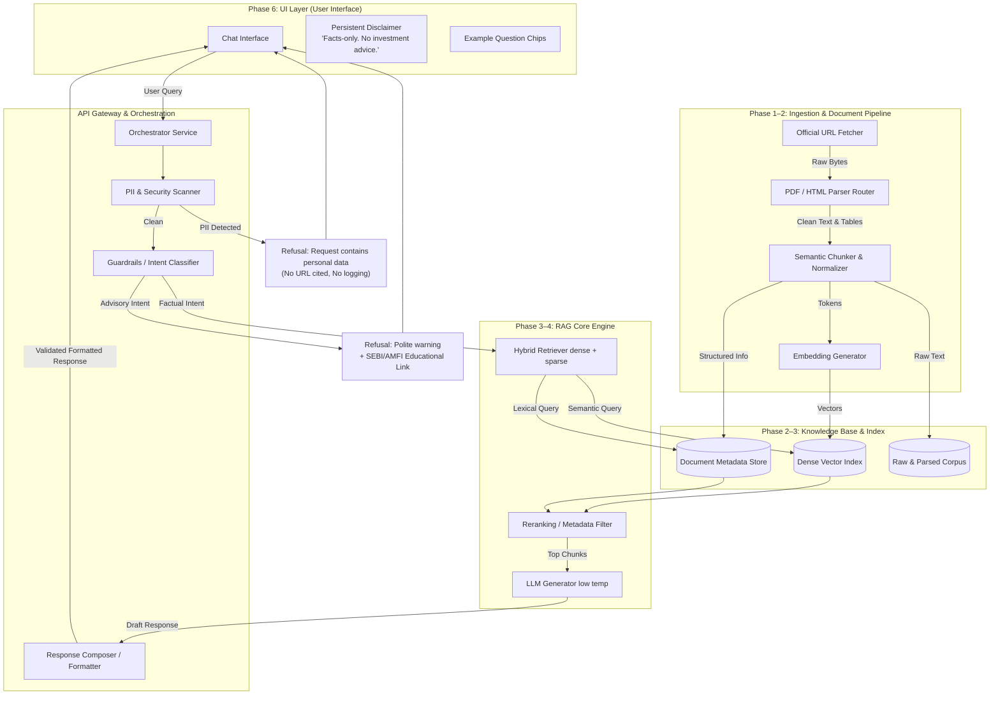

# Phase-Wise Architecture: Mutual Fund FAQ Assistant (Facts-Only RAG)

This document defines a detailed, phased architecture for a lightweight, compliance-first Retrieval-Augmented Generation (RAG) assistant that answers factual mutual fund queries using official public sources only (AMC, AMFI, SEBI). It is derived directly from [problemStatement.md](./problemStatement.md).

---

## 1. Core Architecture Principles

| Principle | Technical Implication | Compliance Alignment |
|:---|:---|:---|
| **Facts-Only Retrieval** | Ground all generation strictly in the retrieved official document chunks. Low temperature (0.0–0.2). | Eliminates hallucinations, prohibits opinions or speculative advice. |
| **Strict Citation Integrity** | Exactly one canonical, official URL cited per response. Determinstic citation overrides. | Full transparency and verification; zero third-party/aggregator URLs. |
| **Constrained Output Formats** | Output is strictly capped at **3 sentences** + 1 citation link + 1 standardized footer. | Prevents cognitive overload, keeps responses direct, objective, and clear. |
| **Fail-Safe Refusal Control** | Early-exit intent classifiers and post-generation guardrails block non-factual queries. | Prohibits investment advice, performance comparisons, or returns. |
| **Privacy by Design** | Strict regex and LLM-based PII scans pre-retrieval. Zero-logs policy for PII-flagged queries. | Prohibits collection of PAN, Aadhaar, OTPs, emails, phone numbers. |
| **Transparency & Freshness** | Standardized footer displaying the source's last-updated date or fallback fetch date. | Ensures users are aware of the exact age and origin of the data. |

---

## 2. High-Level System Architecture View



### Request Flow Analysis
1. **The Ingestion Pipeline (Asynchronous / Batch):** Officially whitelisted URLs are crawled, parsed, chunked, enriched with structured metadata, embedded, and indexed.
2. **The Query Pipeline (Synchronous / Online):**
   - **Step 2.1 (Security):** The incoming query is scanned for PII. If found, it is blocked immediately.
   - **Step 2.2 (Intent Gate):** The query is evaluated for factual vs. advisory intent. Subjective or advisory queries immediately bypass retrieval and return a polite refusal with an educational regulator URL.
   - **Step 2.3 (Hybrid Retrieval):** Factual queries are processed using hybrid search (dense embeddings + sparse keywords) with hard metadata filters applied based on detected mutual fund scheme names.
   - **Step 2.4 (Grounded Generation):** The top-ranked chunks are packed into a prompt. The LLM generates a facts-only response.
   - **Step 2.5 (Post-Validation & Composition):** The system verifies sentence counts, ensures there is exactly one URL citation from the allowlist, appends the freshness footer, and delivers the response.

---

## 3. Technology Stack Selection

| Layer | Recommended Choice | Justification & Role |
|:---|:---|:---|
| **Runtime Environment** | Python 3.11+ | Industry standard for NLP, RAG, and microservices. |
| **API Framework** | FastAPI | High-performance, asynchronous, automatic OpenAPI generation, easy UI integrations. |
| **Vector Database** | Chroma or FAISS (Local) | Zero-overhead local embedding store, perfect for single-tenant or lightweight applications. |
| **Sparse Search Engine** | Rank-BM25 / Whoosh | Essential for exact lexical matching of codes, numeric facts, or specific indices. |
| **Embeddings Model** | `bge-small-en-v1.5` or `text-embedding-3-small` | High dimensional accuracy, resource-efficient, excellent retrieval performance. |
| **LLM Engine** | Groq API (e.g., Llama-3 70B / Mixtral 8x7B) | Lightning fast inference speeds, which is crucial for immediate factual response times. |
| **Document Parsers** | `pypdf`, `pymupdf` (for PDF), `beautifulsoup4`, `trafilatura` (for HTML) | Clean extraction of text and complex tables while stripping boilerplates. |
| **User Interface** | React + Vite (Web App) or Streamlit (Prototype) | Streamlit for instant prototyping; React + Tailwind/CSS for production-grade UX. |
| **Config & Pipelines** | `pydantic` + PyYAML | Strict validation of configuration, environments, prompts, and registries. |

---

## 4. System Data Models

### 4.1 Chunk Schema (`data/processed/chunks.jsonl`)
Every processed chunk must be strictly structured, ensuring provenance is preserved from the original document down to the vector space.
```yaml
chunk_id: string                    # Unique stable UUID (SHA-256 hash of content + URL)
source_url: string                  # Canonical public URL (allowlisted: AMC, AMFI, or SEBI)
document_type: enum                 # factsheet | kim | sid | faq | regulator_guide
amc: string                         # e.g., "HDFC Mutual Fund", "SBI Mutual Fund"
scheme_name: string | null          # Mapped scheme name (null for regulator-wide docs)
scheme_category: string | null      # large-cap | flexi-cap | elss | mid-cap | etc.
section_title: string | null        # Section title from document hierarchy (e.g., "Expense Ratio")
content_hash: string                # Hash of the raw section text
stable_content_hash: string         # Hash of normalized text (excluding volatile fields like today's NAV)
fetched_at: string                  # ISO-8601 Timestamp of original extraction
source_last_updated: string | null  # Date found in document (e.g., "As on April 30, 2026"), else null
text: string                        # Normalized, clean chunk content
embedding_id: string                # Pointer to dense index vector
```

### 4.2 Document Provenance & URL Registry (`data/url_registry.csv`)
Maintains the master list of all scraped materials.
```csv
url,document_type,amc,scheme_name,priority,refresh_cadence,last_successful_fetch
https://www.hdfcfund.com/...,factsheet,HDFC Mutual Fund,HDFC Mid-Cap Opportunities Fund,primary,monthly,2026-05-01T08:00:00Z
https://www.amfiindia.com/...,regulator_guide,AMFI,null,supplementary,quarterly,2026-04-15T12:00:00Z
```

### 4.3 PII-Compliant Audit Log (`data/audit/query_log.jsonl`)
Ensures operational visibility without violating privacy compliance. **Never** log raw queries that fail the PII scanner.
```json
{
  "timestamp": "2026-05-20T20:15:30Z",
  "query_hash": "e3b0c44298fc1c149afbf4c8996fb92427ae41e4649b934ca495991b7852b855",
  "intent_label": "factual",
  "detected_scheme": "HDFC Mid-Cap Opportunities Fund",
  "refused": false,
  "citation_url": "https://www.hdfcfund.com/...",
  "latency_ms": 345,
  "status_code": 200
}
```

---

## 5. Detailed Phase-by-Phase Architecture

```
                       [ PHASE 0: FOUNDATION & COMPLIANCE ]
                                       │
                      [ PHASE 1: CORPUS DEFINITION & ACQUISITION ]
                                       │
                     [ PHASE 2: DOCUMENT PROCESSING & CHUNKING ]
                                       │
                         [ PHASE 3: INDEXING & RETRIEVAL ]
                                       │
                      [ PHASE 4: GENERATION & COMPOSITION ]
                                       │
                      [ PHASE 5: GUARDRAILS & REFUSALS ]
                                       │
                         [ PHASE 6: MINIMAL USER INTERFACE ]
                                       │
                        [ PHASE 7: TESTING & EVALUATION ]
                                       │
                     [ PHASE 8: DEPLOYMENT & OPERATIONS ]
```

### Phase 0: Foundation & Compliance Design

**Goal:** Establish absolute constraints, select the target AMC/schemes, map compliance rules, and assemble the golden validation dataset.

*   **Activities:**
    1.  **AMC Selection:** Pick 1 target AMC (e.g., HDFC Mutual Fund) and choose 3–5 representative schemes across distinct categories (e.g., Large-Cap, Flexi-Cap, ELSS/Tax Saver).
    2.  **Official URL Curation:** Compile an exact sheet of 15–25 official public URLs (Factsheets, KIMs, SIDs, official AMC FAQs, SEBI/AMFI guidance pages, and tax guide download pages).
    3.  **Compliance Rule Specification:** Finalize the response formatting parameters (max 3 sentences, 1 citation link, mandatory updated footer).
    4.  **Golden Dataset Compilation:** Hand-curate `eval/golden_queries.jsonl` with 50+ queries divided into factual (with expected answers and source URLs) and advisory/subjective queries (with expected refusals).
*   **Deliverables:**
    *   `config/amc.yaml` containing chosen schemes and canonical configurations.
    *   `data/url_registry.csv` curating whitelisted paths.
    *   `docs/complianceRules.md` capturing operational policies.
    *   `eval/golden_queries.jsonl` as the baseline regression test suite.
*   **Exit Criteria:** Successful validation of `config/amc.yaml` and `data/url_registry.csv` by a foundation verification script checking that all target domains belong to allowed official hostnames (`hdfcfund.com`, `amfiindia.com`, `sebi.gov.in`).

---

### Phase 1: Corpus Definition & Acquisition

**Goal:** Build a robust, polite, and fully trackable scraping pipeline to ingest raw HTML and PDF artifacts from official sites.

*   **Sub-Phase 1.1 — Robust Fetcher:**
    *   Develop a network client that reads `data/url_registry.csv` and retrieves contents.
    *   Implement retries with exponential backoff, rate limiting (maximum 1 request per second), custom User-Agents, and check `robots.txt` paths before fetching.
    *   Store fetched artifacts in `data/raw/<doc_id>/<timestamp>.<ext>` alongside a corresponding `meta.json` recording response headers, MD5 hashes, and HTTP status codes.
*   **Sub-Phase 1.2 — Extractor Router:**
    *   Inspect file MIME types: PDFs are routed to `pdf_extractor`, HTML to `html_extractor`.
    *   HTML pages: extract core article text using CSS selectors, stripping standard headers, navbars, ads, and footers.
    *   PDF pages: extract text blocks, tracking page numbers and tables.
*   **Sub-Phase 1.3 — Cleaners & Provenance Log:**
    *   Strip boilerplate legal text, disclaimer blocks, and links.
    *   Standardize text encoding (Unicode NFKC, convert currency formats like "Rs." or "INR" to "₹", normalize percentage signs, smart quotes).
    *   Generate a stable document content hash by excluding volatile metrics (like daily NAV values or AUM figures) to prevent redundant vector database upserts on daily crawls.
*   **Exit Criteria:** 100% of URLs in the registry fetched successfully; raw files saved; verification script confirms metadata hashes are fully computed.

---

### Phase 2: Document Processing & Chunking

**Goal:** Transform raw extracted documents into clean, semantic, structured text chunks enriched with exhaustive metadata.

*   **Chunking Strategy:**
    *   **Document-Specific Chunking:**
        *   *Factsheets / KIMs / SIDs:* Chunk by logical sections using header detection (e.g., separating "Investment Objective", "Expense Ratio", "Exit Load").
        *   *FAQs / Help Guides:* Maintain each Question/Answer pair as an individual atomic chunk.
        *   *Regulator Guides:* Chunk by paragraph with a soft limit of 250 tokens and a hard limit of 400 tokens, using a 10% (30-token) slide overlap.
    *   **Chunking Heuristics:**
        *   Never split numeric tables or lists across chunk boundaries.
        *   Prepend context headers transiently during embedding generation (e.g., `f"Fund: {scheme_name} | Section: {section_title}\n\n{text}"`) to prevent identical boilerplate layout pages from bleeding into the same vector space.
*   **Metadata Enrichment:**
    *   Extract the "Last Updated" date directly from the document headers or footnotes when present. If not found, fall back to the scraping `fetched_at` date.
*   **Exit Criteria:** All extracted data parsed into `data/processed/chunks.jsonl` with valid UUIDs, non-empty text, and complete metadata fields.

---

### Phase 3: Indexing & Retrieval

**Goal:** Create a high-performance local vector index and a lexical sparse search engine to execute metadata-filtered hybrid search.

*   **Retrieval Components:**
    1.  **Dense Indexing:** Embed chunks from Phase 2 using the selected embedding model and load them into a FAISS or Chroma index.
    2.  **Sparse Indexing:** Index chunk texts using Rank-BM25 to capture precise lexical terms (e.g., exact percentages or index names like "Nifty 50").
    3.  **Metadata Pre-Filtering:** Write a query analyzer that detects mutual fund schemes named in the query. Apply a **hard metadata filter** restricting search space strictly to that scheme's chunks.
    4.  **Hybrid Search Fusion:** Retrieve Top-K chunks from both dense and sparse indexes, merging their scores using Reciprocal Rank Fusion (RRF):
        $$RRF\_Score(d) = \sum_{m \in \{dense, sparse\}} \frac{1}{60 + Rank_m(d)}$$
    5.  **Score Thresholding:** Establish a minimum score cut-off. If the best-matching chunk falls below this threshold, bypass LLM generation and route to a "Not Found" response.
*   **Exit Criteria:** Retrieval recall checked against the Golden Dataset: relevant chunks must appear in the top-3 results for at least 95% of factual queries.

---

### Phase 4: (Merged into Phase 3)

**Goal:** Ground the LLM with retrieved context to generate compliant, facts-only answers restricted in length and cited correctly.

*   **Workflow Components:**
    1.  **Context Packer:** Deduplicate retrieved chunks and build the prompt context.
    2.  **Low-Temperature Generation:** Set LLM temperature to `0.0` or `0.1` to enforce strict compliance.
    3.  **Strict System Prompting:**
        ```
        System Instructions:
        You are a compliance-first facts-only Mutual Fund FAQ Assistant.
        Answer the user's query using ONLY the provided verified context.
        If the context does not contain the answer, state that the information could not be verified in official sources.
        Rules:
        1. Max 3 sentences.
        2. No investment advice, opinions, or recommendations.
        3. State facts objectively.
        4. Cite exactly one source URL from the provided context.
        ```
    4.  **Deterministic Citation Override:** Compare the URL cited by the LLM with the source URLs of the retrieved chunks. If the LLM generates a URL outside of the verified chunks, overwrite it with the URL of the highest-scoring retrieved chunk.
    5.  **Response Composer:** Format the final output, adding the mandatory citation link and appending the standardized footer using the newest date found in the chunk metadata:
        `Last updated from sources: YYYY-MM-DD`
*   **Exit Criteria:** Average generation latency under 2 seconds; zero hallucinations found during evaluation checks on the factual Golden Dataset.

---

### Phase 5: Guardrails & Refusal Handling

**Goal:** Block personal data, subjective queries, and investment advice before or after execution to protect the user and maintain compliance.

```
       [ USER QUERY ]
              │
      ( PII regex scan ) ───[ Match ]──> [ HARD REFUSAL ] (No logs, no citation)
              │
           [ Clean ]
              │
    ( Intent Classification ) ──[ Advisory ]──> [ TEMPLATED REFUSAL ] + Educational Link
              │
          [ Factual ]
              │
      [ RAG PIPELINE ] ───> [ OUTPUT GENERATION ] ───> ( Post-Gen Scan ) ──[ Advice Leak ]──> [ REFUSAL ]
                                                              │
                                                        [ Compliant ] ──> [ USER ANSWER ]
```

*   **Security & Compliance Layers:**
    1.  **PII Scanner (Pre-Retrieval Gate):** Run regex checks for PAN, Aadhaar, bank accounts, emails, and phone numbers. If flagged, immediate hard refusal returned: *"For your security, please do not share personal identifiers like PAN, account numbers, or OTPs. I cannot process this request."* (Bypass database logs entirely).
    2.  **Intent Classifier:** Use a semantic model or zero-shot classifier to check for advisory words ("should I invest", "is it good", "which fund is better").
    3.  **Templated Refusal & Redirect:** If classified as advisory, return a friendly refusal: *"I am a facts-only assistant and cannot provide investment advice, fund recommendations, or performance comparisons. For educational information about mutual fund structures, you can read more here."*
    4.  **Educational Links:** Map specific investment topics to static educational URLs from AMFI or SEBI (never link to third-party blogs or aggregators).
    5.  **Post-Generation Scan:** Perform a regex scan on LLM outputs for banned advisory words ("recommend", "better", "buy", "sell", "growth forecast"). If detected, suppress the generation and substitute a standard refusal response.
*   **Exit Criteria:** 100% of advisory queries in the golden dataset successfully refused; 0% of PII-containing queries recorded in the search logs.

---

### Phase 6: Minimal User Interface

**Goal:** Deliver a fast, responsive, and clear interface centered around transparency, compliance, and ease of use.

*   **Interface Requirements:**
    *   **Persistent Disclaimer Banner:** Positioned prominently at the top of the interface:
        `⚠️ Facts-only Assistant: I provide objective, verifiable information from official documents. I cannot provide investment advice, suggestions, or comparisons.`
    *   **Interactive Example Chips:** Present three preset clickable queries matching the core capabilities:
        *   *"What is the expense ratio for HDFC Flexi Cap Fund?"*
        *   *"What is the lock-in period of an ELSS tax saver fund?"*
        *   *"Explain the exit load for HDFC Mid-Cap Opportunities Fund."*
    *   **Visual Citation Cards:** Render citation links as clean, clickable, card-like buttons rather than in-line markdown, making them clearly visible.
    *   **Loading & Timeout Handling:** Show clear skeleton screens during API requests; render custom alert blocks for timeouts or connection issues.
    *   **UI-to-API Contract:**
        ```json
        // POST /api/chat
        {
          "query": "What is the exit load for HDFC Flexi Cap Fund?"
        }
        // 200 OK Response
        {
          "answer": "HDFC Flexi Cap Fund charges an exit load of 1.00% if units are redeemed or switched out within 1 year from the date of allotment. No exit load is charged for redemptions made after 1 year. Please verify details in the official factsheet.",
          "citation_url": "https://www.hdfcfund.com/...",
          "footer": "Last updated from sources: 2026-04-30",
          "is_refusal": false
        }
        ```
*   **Exit Criteria:** Responsive web page loaded locally; all example chips functional; disclaimer persists across sessions.

---

### Phase 7: Testing, Evaluation & QA

**Goal:** Ensure absolute compliance, retrieval precision, and formatting accuracy across a series of automated and manual tests.

```
┌─────────────────────────────────────────────────────────────┐
│                       TEST HARNESS                          │
├───────────────────┬───────────────────┬─────────────────────┤
│    Unit Tests     │ Integration Tests │   RAG Evaluations   │
├───────────────────┼───────────────────┼─────────────────────┤
│ • sentence parser │ • fetch-to-chunk  │ • citation domain   │
│ • PII regex scan  │ • search-to-fuse  │ • factual overlap   │
│ • footer builder  │ • UI-to-API ping  │ • refusal accuracy  │
└───────────────────┴───────────────────┴─────────────────────┘
```

*   **Test Layers:**
    *   **Unit Testing:** Validate utility functions (e.g., verifying the sentence parser accurately splits on abbreviations, testing the PII checker's regex patterns, confirming date formatting).
    *   **Integration Testing:** End-to-end execution testing: scraping a mock page -> parsing -> indexing -> retrieving -> generating output.
    *   **RAG System Evaluation:**
        *   *Retrieval Hit Rate:* Confirm target documents appear in the Top-K results.
        *   *Domain Constraints:* Validate that all citation URLs point to the allowlist.
        *   *Compliance Audit:* Ensure all answers are under 3 sentences, contain exactly 1 citation URL, and have a valid updated footer.
*   **Exit Criteria:** 100% test pass rate across the unit test suite; RAG evaluation reports zero compliance violations and a citation match rate of 98%+ on the golden dataset.

---

### Phase 8: Deployment, Operations & Documentation

**Goal:** Build a reliable package, set up simple operations, document setup, and establish the background update processes.

*   **Operational Setup:**
    *   **Local Execution:** Deliver a straightforward setup using `pip install -r requirements.txt` and `.env` configuration files for keys.
    *   **Containerization:** Provide a `docker-compose.yaml` file spinning up the FastAPI service and the Streamlit/React web frontend in parallel.
    *   **Data Updates (Cron Job):**
        Create a GitHub Actions schedule or a system cron job to run the update pipeline:
        ```bash
        0 2 * * 1  cd /app && python -m src.ingest.refresh --config config/amc.yaml
        ```
    *   **Health and System Monitoring:**
        Set up a `/health` endpoint to monitor vector store availability, API response metrics, and corpus age.
*   **Documentation Requirements:**
    *   README with detailed local setup, AMC definitions, and scheme mappings.
    *   Explicit section detailing known system limitations (e.g., handling scanned image PDFs, language constraints, dependency on third-party page layout stability).
*   **Exit Criteria:** A clean deployment run from scratch finishes in under 10 minutes; the `/health` endpoint responds with a `200 OK` status.

---

## 6. End-to-End Phased Implementation Timeline

The project is structured across sequential phases to maintain alignment with the guidelines.

```mermaid
gantt
    title Project Implementation Timeline
    dateFormat  YYYY-MM-DD
    section Setup & Ingestion
    Phase 0: Foundation Design     :active, p0, 2026-05-01, 3d
    Phase 1: Ingest & Crawling     :        p1, after p0,  5d
    Phase 2: Parsing & Chunking    :        p2, after p1,  4d
    section Core RAG Development
    Phase 3: Hybrid Indexing       :        p3, after p2,  4d
    Phase 4: Low-Temp Generation   :        p4, after p3,  5d
    Phase 5: Guardrails & Refusals :        p5, after p4,  4d
    section Interface & Release
    Phase 6: Minimal UI Layout     :        p6, after p5,  3d
    Phase 7: Testing & QA Audit    :        p7, after p6,  4d
    Phase 8: Deployment & Docs     :        p8, after p7,  2d
```

---

## 7. Security & Compliance Flow Architecture

```
User Query ──> [ SSL Egress ] ──> [ WAF Gate ] ──> [ FastAPI Server ]
                                                      │
                                                      ├──> [ Regex PII Scanner ] ──(PII Match)──> [ 400 Refusal ]
                                                      │                                             (No logs)
                                                      └──> [ Intent Guardrail ] ──(Advisory)───> [ Polite Refusal ]
                                                              │                                     + Edu Link
                                                              └──> [ RAG Retrieval Engine ]
                                                                      │
                                                                      └──> [ Vector Query with Metadata Filter ]
```

*   **API Security Guidelines:**
    *   **Zero PII Retention:** Queries flagged for PII are discarded immediately from system logs and memory.
    *   **Allowlist Routing:** Incoming documents are filtered against a hard domain allowlist. Citations are verified against the corpus registry database before generation.
    *   **Container Security:** Services run as non-root users with read-only access to source code mounts.

---

## 8. Failure Modes & Automated Mitigations

| Identified Failure Mode | System Impact | Automated Mitigation / Fail-Safe |
|:---|:---|:---|
| **Out-of-Domain Scrapes** | Potential ingestion of malicious content or third-party ads. | Pre-fetch URL domain verification against allowlisted patterns. |
| **Volatile Data Shift** | Changing NAV rates generate false update triggers. | Strip NAV, AUM, and date headers when calculating the stable document hash. |
| **Missing Document Sections** | Missing critical data (e.g., KIM contains no exit load text). | Parser triggers a validation alert and flags the document status as `degraded` in the registry. |
| **Empty Vector Search Results** | Search scores fall below the minimum confidence threshold. | Skip the LLM step and directly return a structured "Not Found" response. |
| **Advisory Leakage** | LLM generates opinions despite strict instructions. | Post-generation regex scanning checks outputs for banned words, replacing the response if found. |
| **Network Downtime** | Scraper cannot connect to official sources. | Ingestion scripts retry with backoff, logging failures without overwriting the existing index. |

---

## 9. Direct Mapping to Problem Statement Deliverables

| Problem Statement Requirement | Implementing Architecture Component | Architectural Phase |
|:---|:---|:---|
| **Corpus Selection** | Structured configurations inside `config/amc.yaml` and `data/url_registry.csv`. | Phase 0 & Phase 1 |
| **Facts-Only Assistant Scope** | Hard metadata filters, hybrid dense-sparse search, and low-temperature LLM generation. | Phase 3 & Phase 4 |
| **Length Limitation (≤3 sentences)** | Custom sentence splitting logic in post-generation validation checks. | Phase 4 & Phase 7 |
| **Single Citation Link** | Deterministic citation override module matching chunks to canonical URLs. | Phase 4 |
| **Freshness Footer** | Metadata collection parsing updated dates, rendered at the bottom of the response. | Phase 2 & Phase 4 |
| **Advisory Refusal & Redirection** | Intent classifier gate checking queries and returning educational AMFI/SEBI links. | Phase 5 |
| **PII Data Compliance** | Pre-retrieval scanner identifying and blocking personal identifiers. | Phase 5 |
| **Minimal User Interface** | Responsive layout including example chips, a disclaimer banner, and citation cards. | Phase 6 |
| **Golden Set Validation** | Comprehensive test execution checking outputs against curated test queries. | Phase 7 |

---

## 10. Architectural Summary

The proposed architecture establishes a **compliance-first, highly reliable, and audit-ready** Retrieval-Augmented Generation (RAG) system. By prioritizing facts-only grounding, enforcing zero PII retention, and incorporating rigorous intent-filtering guardrails, the assistant ensures that retail investors receive verified, objective, and timely information. 

Rather than aiming for conversational fluency at the cost of accuracy, this RAG architecture is engineered to prioritize **trust, safety, and source-backed transparency** above all else—perfectly aligned with the strict standards expected of modern financial products like Groww.
